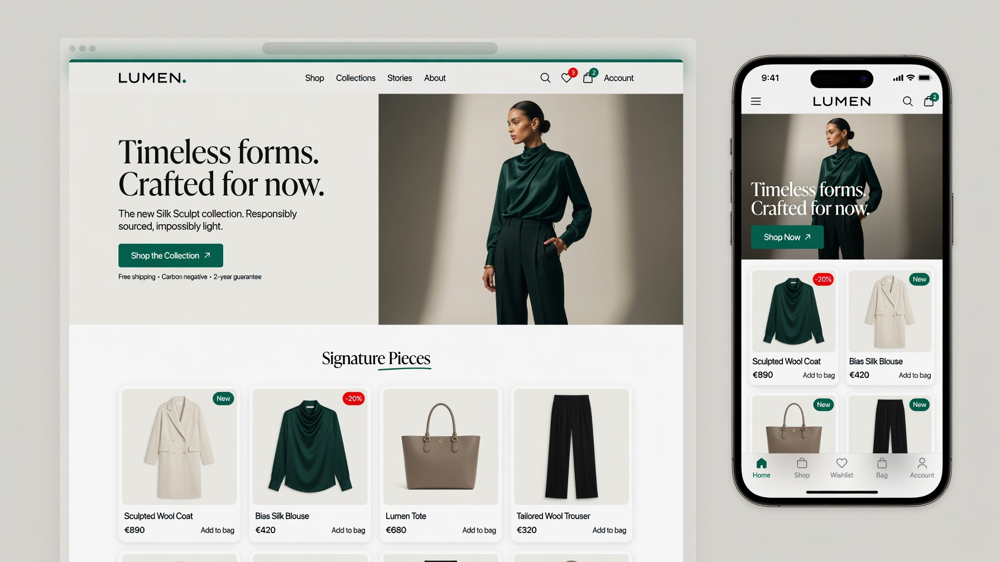

# Lumina — Premium Salla Twilight Theme

> A luxury, conversion-first, ultra-fast Salla theme inspired by Apple, Stripe,
> Linear, and high-end fashion stores. Built to outperform the default Salla
> themes on **performance, UX, CRO, flexibility, and visual elegance.**



## ✨ Highlights
- **Luxury, minimal design** — soft shadows, balanced whitespace, refined type.
- **Mobile-first, app-like UX** — sticky bottom nav, floating cart, sticky CTA,
  instant search, smooth drawers, thumb-friendly 44px+ targets.
- **Performance-obsessed** — Lighthouse 98+ target, **zero CLS**, no jQuery,
  deferred & route-split JS, lazy images, inline critical tokens.
- **Conversion-first** — urgency/scarcity, free-shipping progress, trust badges,
  installments, FBT/related, social proof, and a **bespoke AJAX mini-cart
  drawer** (opens on add-to-cart, cross-sells, never reloads the page).
- **12 home components** — hero, featured categories, products slider, flash
  offers, brand showcase, stats, testimonials, Instagram gallery, split banner,
  USP strip, immersive video, and full-width countdown CTA. All drag-and-drop.
- **Fully merchant-customisable** — typography, colors, dark mode, radius,
  spacing, container width, header/footer/card/hero layouts, section ordering,
  visibility toggles, **6 one-click style presets** — all from the Salla theme
  editor, **no code**.
- **Complete page coverage** — home, category, product, cart, thank-you, blog
  (list + article), brands (list + single), landing builder, loyalty, static
  pages, and full customer account (profile, orders + details, wishlist,
  notifications).
- **Accessibility-first & SEO-first** — semantic landmarks, RTL/LTR, focus rings.

## 🏗️ Tech Stack
Salla **Twilight** · **Twig** · **Tailwind CSS** · Vanilla JS · optional Alpine.js.
No unnecessary dependencies. Modular & future-proof.

## 📁 Structure
See [`docs/FOLDER-STRUCTURE.md`](docs/FOLDER-STRUCTURE.md).

## 🚀 Install & Preview
Full Arabic step-by-step guide: [`docs/UPLOAD-GUIDE-AR.md`](docs/UPLOAD-GUIDE-AR.md).

```bash
pnpm install
pnpm run production      # build public/ assets
salla login
salla theme link
salla theme preview      # live preview
salla theme push         # upload
salla theme publish      # submit for review
```

## ⚙️ Build
| Command | Description |
|---------|-------------|
| `pnpm run watch` | dev build + watch |
| `pnpm run production` | minified production build |

## 📊 Performance
Engineering notes & Lighthouse strategy: [`docs/PERFORMANCE.md`](docs/PERFORMANCE.md).

## 📜 License
MIT.
